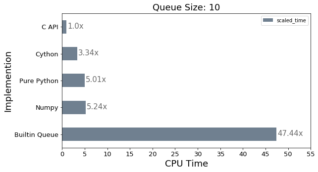
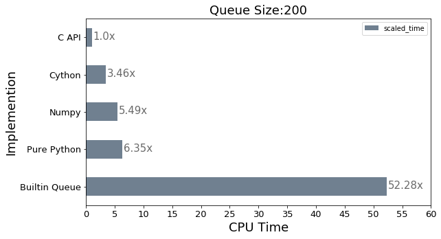

# Profile and Benchmark

## Run profile.py
`python3 profile_/profile.py`

## Results

### Importing things and profile function


```python
import pandas as pd
import matplotlib.pyplot as plt

from profile_ import profile
```

### Profiling for Queue size of 10


```python
result = profile(q_size=10, data_size=1500, levels=5, runs=100)
result['scaled_time'] = result['time'] / min(result['time'])
result = result.sort_values('scaled_time')
result
```


<div>
<table border="1" class="dataframe">
  <thead>
    <tr style="text-align: right;">
      <th></th>
      <th>type_</th>
      <th>time</th>
      <th>time_per_loop</th>
      <th>q_size</th>
      <th>data_size</th>
      <th>levels</th>
      <th>runs</th>
      <th>scaled_time</th>
    </tr>
  </thead>
  <tbody>
    <tr>
      <th>0</th>
      <td>C API</td>
      <td>0.000166</td>
      <td>1.108109e-07</td>
      <td>10</td>
      <td>1500</td>
      <td>5</td>
      <td>100</td>
      <td>1.000000</td>
    </tr>
    <tr>
      <th>2</th>
      <td>Cython</td>
      <td>0.000592</td>
      <td>3.944243e-07</td>
      <td>10</td>
      <td>1500</td>
      <td>5</td>
      <td>100</td>
      <td>3.559437</td>
    </tr>
    <tr>
      <th>4</th>
      <td>Numpy</td>
      <td>0.001077</td>
      <td>7.180260e-07</td>
      <td>10</td>
      <td>1500</td>
      <td>5</td>
      <td>100</td>
      <td>6.479744</td>
    </tr>
    <tr>
      <th>1</th>
      <td>Pure Python</td>
      <td>0.001078</td>
      <td>7.185063e-07</td>
      <td>10</td>
      <td>1500</td>
      <td>5</td>
      <td>100</td>
      <td>6.484078</td>
    </tr>
    <tr>
      <th>3</th>
      <td>Builtin Queue</td>
      <td>0.009693</td>
      <td>6.461801e-06</td>
      <td>10</td>
      <td>1500</td>
      <td>5</td>
      <td>100</td>
      <td>58.313792</td>
    </tr>
  </tbody>
</table>
</div>


```python
ax = result.plot(kind='barh', x='type_', y='scaled_time', color="slategray", fontsize=13, figsize=(9,5))
ax.set_alpha(0.1)
ax.set_title("Queue Size: 10", fontsize=18);
ax.set_xlabel("CPU Time", fontsize=18);
ax.set_ylabel("Implemention", fontsize=18);
ax.set_xticks([i*5 for i in range(int(max(result['scaled_time']) / 5) + 3)])

for i in ax.patches:
    ax.text(
        i.get_width()+.2, i.get_y()+.31, 
        f'{round((i.get_width()), 2)}x', 
        fontsize=15, color='dimgrey',
    )
    
ax.invert_yaxis()

```





### Profiling for Queue size of 200


```python
result = profile(q_size=200, data_size=1500, levels=5, runs=100)
result['scaled_time'] = result['time'] / min(result['time'])
result = result.sort_values('scaled_time')
result
```


<div>
<table border="1" class="dataframe">
  <thead>
    <tr style="text-align: right;">
      <th></th>
      <th>type_</th>
      <th>time</th>
      <th>time_per_loop</th>
      <th>q_size</th>
      <th>data_size</th>
      <th>levels</th>
      <th>runs</th>
      <th>scaled_time</th>
    </tr>
  </thead>
  <tbody>
    <tr>
      <th>0</th>
      <td>C API</td>
      <td>0.000166</td>
      <td>1.103532e-07</td>
      <td>200</td>
      <td>1500</td>
      <td>5</td>
      <td>100</td>
      <td>1.000000</td>
    </tr>
    <tr>
      <th>2</th>
      <td>Cython</td>
      <td>0.000572</td>
      <td>3.814821e-07</td>
      <td>200</td>
      <td>1500</td>
      <td>5</td>
      <td>100</td>
      <td>3.456919</td>
    </tr>
    <tr>
      <th>4</th>
      <td>Numpy</td>
      <td>0.000909</td>
      <td>6.060601e-07</td>
      <td>200</td>
      <td>1500</td>
      <td>5</td>
      <td>100</td>
      <td>5.492003</td>
    </tr>
    <tr>
      <th>1</th>
      <td>Pure Python</td>
      <td>0.001050</td>
      <td>7.002741e-07</td>
      <td>200</td>
      <td>1500</td>
      <td>5</td>
      <td>100</td>
      <td>6.345752</td>
    </tr>
    <tr>
      <th>3</th>
      <td>Builtin Queue</td>
      <td>0.008653</td>
      <td>5.768911e-06</td>
      <td>200</td>
      <td>1500</td>
      <td>5</td>
      <td>100</td>
      <td>52.276786</td>
    </tr>
  </tbody>
</table>
</div>


```python
ax = result.plot(kind='barh', x='type_', y='scaled_time', color="slategray", fontsize=13, figsize=(9,5))
ax.set_alpha(0.1)
ax.set_title("Queue Size:200", fontsize=18);
ax.set_xlabel("CPU Time", fontsize=18);
ax.set_ylabel("Implemention", fontsize=18);
ax.set_xticks([i*5 for i in range(int(max(result['scaled_time']) / 5) + 3)])

for i in ax.patches:
    ax.text(
        i.get_width()+.2, i.get_y()+.31, 
        f'{round((i.get_width()), 2)}x', 
        fontsize=15, color='dimgrey',
    )
    
ax.invert_yaxis()

```





```python

```
