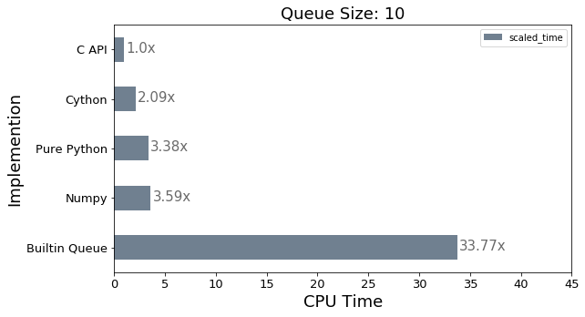
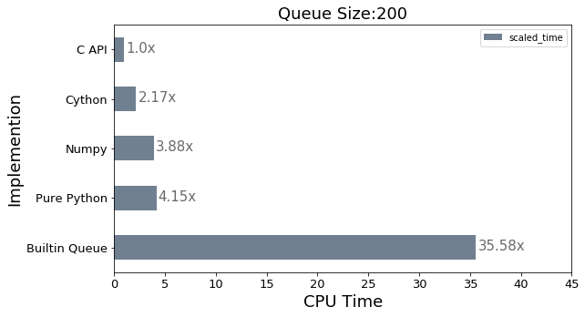

```python
import pandas as pd
import matplotlib.pyplot as plt

from profiles import profile
```


```python
results = pd.DataFrame()  
```

### Profiling for Queue size of 10


```python
result = profile(10, 1500, 5, 100)
result['scaled_time'] = result['time'] / min(result['time'])
result = result.sort_values('scaled_time')
result
```


<div>
<style scoped>
    .dataframe tbody tr th:only-of-type {
        vertical-align: middle;
    }

    .dataframe tbody tr th {
        vertical-align: top;
    }

    .dataframe thead th {
        text-align: right;
    }
</style>
<table border="1" class="dataframe">
  <thead>
    <tr style="text-align: right;">
      <th></th>
      <th>type_</th>
      <th>time</th>
      <th>time_per_loop</th>
      <th>q_size</th>
      <th>data_size</th>
      <th>levels</th>
      <th>runs</th>
      <th>scaled_time</th>
    </tr>
  </thead>
  <tbody>
    <tr>
      <th>0</th>
      <td>C API</td>
      <td>0.000266</td>
      <td>1.773230e-07</td>
      <td>10</td>
      <td>1500</td>
      <td>5</td>
      <td>100</td>
      <td>1.000000</td>
    </tr>
    <tr>
      <th>2</th>
      <td>Cython</td>
      <td>0.000557</td>
      <td>3.710495e-07</td>
      <td>10</td>
      <td>1500</td>
      <td>5</td>
      <td>100</td>
      <td>2.092506</td>
    </tr>
    <tr>
      <th>1</th>
      <td>Pure Python</td>
      <td>0.000898</td>
      <td>5.989419e-07</td>
      <td>10</td>
      <td>1500</td>
      <td>5</td>
      <td>100</td>
      <td>3.377688</td>
    </tr>
    <tr>
      <th>4</th>
      <td>Numpy</td>
      <td>0.000956</td>
      <td>6.373894e-07</td>
      <td>10</td>
      <td>1500</td>
      <td>5</td>
      <td>100</td>
      <td>3.594510</td>
    </tr>
    <tr>
      <th>3</th>
      <td>Builtin Queue</td>
      <td>0.008982</td>
      <td>5.987733e-06</td>
      <td>10</td>
      <td>1500</td>
      <td>5</td>
      <td>100</td>
      <td>33.767372</td>
    </tr>
  </tbody>
</table>
</div>


```python
ax = result.plot(kind='barh', x='type_', y='scaled_time', color="slategray", fontsize=13, figsize=(9,5))
ax.set_alpha(0.1)
ax.set_title("Queue Size: 10", fontsize=18);
ax.set_xlabel("CPU Time", fontsize=18);
ax.set_ylabel("Implemention", fontsize=18);
ax.set_xticks([i*5 for i in range(10)])

for i in ax.patches:
    ax.text(
        i.get_width()+.2, i.get_y()+.31, 
        f'{round((i.get_width()), 2)}x', 
        fontsize=15, color='dimgrey',
    )
    
ax.invert_yaxis()

```





### Profiling for Queue size of 200


```python
result = profile(200, 1500, 5, 100)
result['scaled_time'] = result['time'] / min(result['time'])
result = result.sort_values('scaled_time')
result
```


<div>
<style scoped>
    .dataframe tbody tr th:only-of-type {
        vertical-align: middle;
    }

    .dataframe tbody tr th {
        vertical-align: top;
    }

    .dataframe thead th {
        text-align: right;
    }
</style>
<table border="1" class="dataframe">
  <thead>
    <tr style="text-align: right;">
      <th></th>
      <th>type_</th>
      <th>time</th>
      <th>time_per_loop</th>
      <th>q_size</th>
      <th>data_size</th>
      <th>levels</th>
      <th>runs</th>
      <th>scaled_time</th>
    </tr>
  </thead>
  <tbody>
    <tr>
      <th>0</th>
      <td>C API</td>
      <td>0.000242</td>
      <td>1.611077e-07</td>
      <td>200</td>
      <td>1500</td>
      <td>5</td>
      <td>100</td>
      <td>1.000000</td>
    </tr>
    <tr>
      <th>2</th>
      <td>Cython</td>
      <td>0.000523</td>
      <td>3.488233e-07</td>
      <td>200</td>
      <td>1500</td>
      <td>5</td>
      <td>100</td>
      <td>2.165155</td>
    </tr>
    <tr>
      <th>4</th>
      <td>Numpy</td>
      <td>0.000939</td>
      <td>6.256998e-07</td>
      <td>200</td>
      <td>1500</td>
      <td>5</td>
      <td>100</td>
      <td>3.883735</td>
    </tr>
    <tr>
      <th>1</th>
      <td>Pure Python</td>
      <td>0.001003</td>
      <td>6.684370e-07</td>
      <td>200</td>
      <td>1500</td>
      <td>5</td>
      <td>100</td>
      <td>4.149006</td>
    </tr>
    <tr>
      <th>3</th>
      <td>Builtin Queue</td>
      <td>0.008598</td>
      <td>5.732310e-06</td>
      <td>200</td>
      <td>1500</td>
      <td>5</td>
      <td>100</td>
      <td>35.580601</td>
    </tr>
  </tbody>
</table>
</div>


```python
ax = result.plot(kind='barh', x='type_', y='scaled_time', color="slategray", fontsize=13, figsize=(9,5))
ax.set_alpha(0.1)
ax.set_title("Queue Size:200", fontsize=18);
ax.set_xlabel("CPU Time", fontsize=18);
ax.set_ylabel("Implemention", fontsize=18);
ax.set_xticks([i*5 for i in range(10)])

for i in ax.patches:
    ax.text(
        i.get_width()+.2, i.get_y()+.31, 
        f'{round((i.get_width()), 2)}x', 
        fontsize=15, color='dimgrey',
    )
    
ax.invert_yaxis()

```




